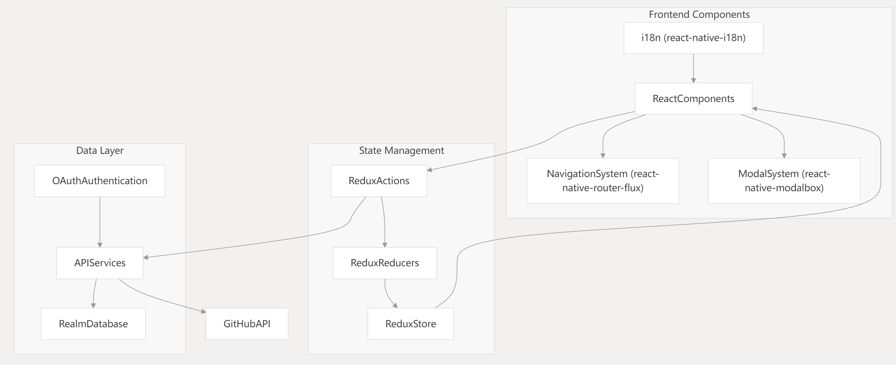
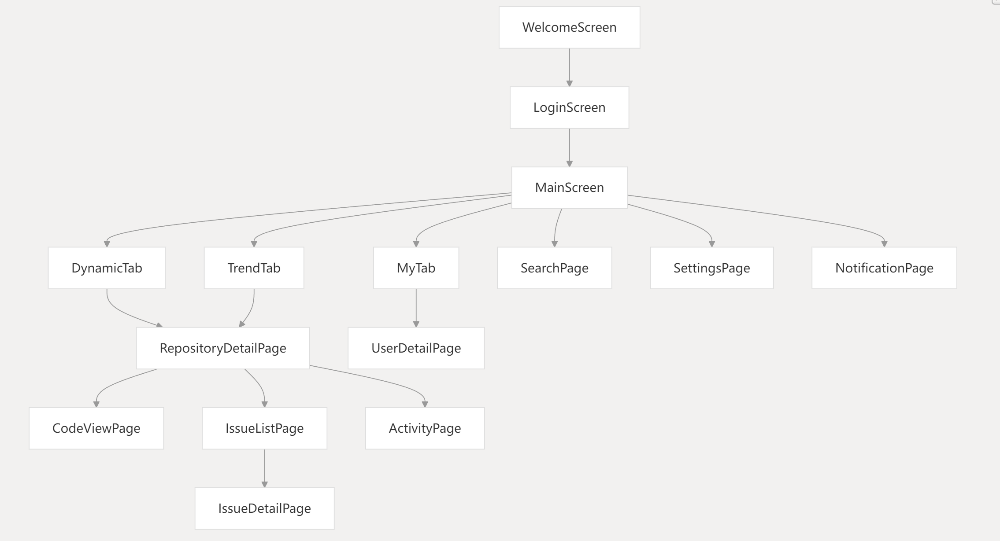
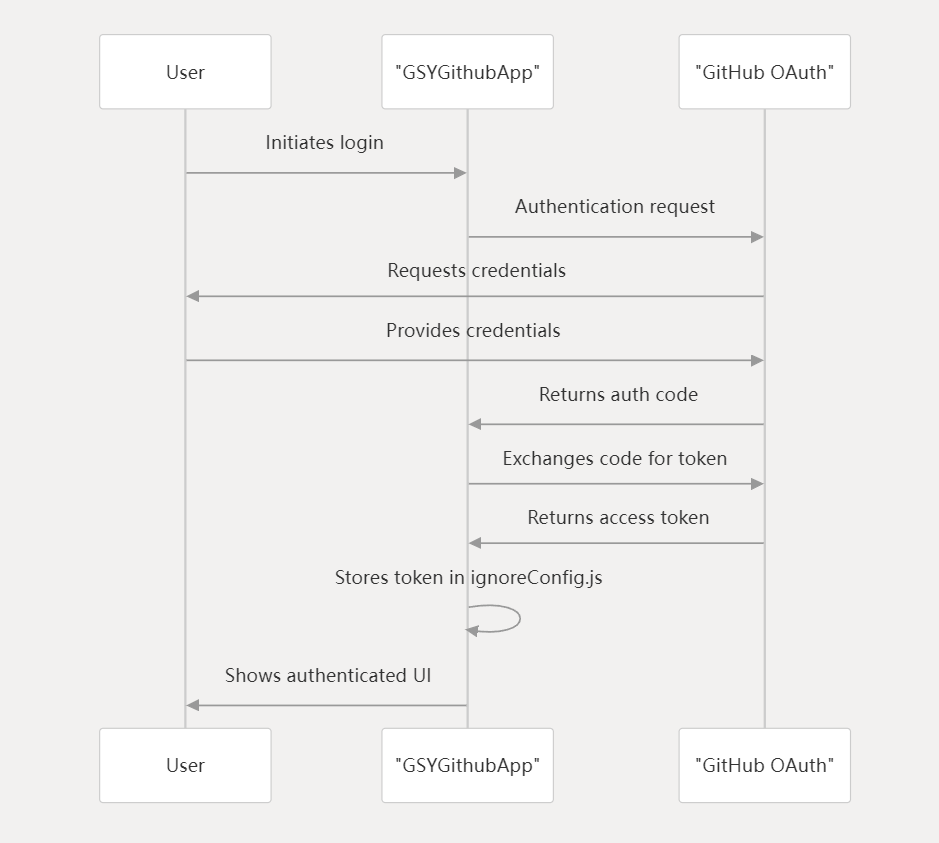
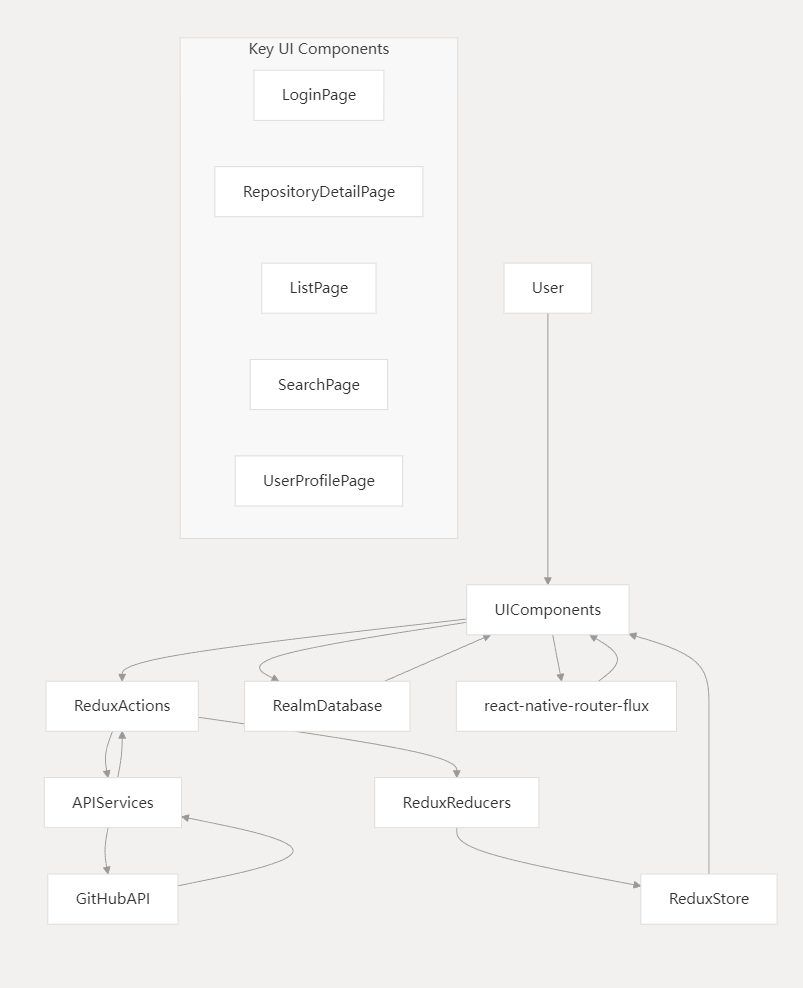

## GSYGithubAPP

An open-source, cross-platform GitHub client built with React Native. It aims to provide a richer feature set and a better daily experience for managing and browsing GitHub.

Companion implementations in other stacks:

- Weex: https://github.com/CarGuo/GSYGithubAppWeex
- Flutter: https://github.com/CarGuo/GSYGithubAppFlutter
- Android Kotlin (View): https://github.com/CarGuo/GSYGithubAppKotlin
- Android Kotlin (Compose): https://github.com/CarGuo/GSYGithubAppKotlinCompose

```
Developed with React Native, supporting both Android and iOS.

This project is also suitable for hands-on React Native learning, covering usage across various libraries and interactions with native modules.

Features and UX are improved from time to time based on usage and feedback. Issues and suggestions are welcome.
```
-----

[](https://github.com/CarGuo/GSYGithubAPP/stargazers)
[](https://github.com/CarGuo/GSYGithubAPP/network)
[](https://github.com/CarGuo/GSYGithubAPP/issues)
[](https://github.com/CarGuo/GSYGithubAPP/blob/master/LICENSE)

### RN 0.80.2

### Build and Run

1. Set up the React Native development environment.
2. Clone the repository and run `npm install` in the project root.
3. Create `app/config/ignoreConfig.js` and fill in your GitHub `client_id` and `client_secret`:

     export const CLIENT_ID = "xxxx";
     export const CLIENT_SECRET = "xxxx";

   Optional (for Qiniu upload):

     export const ACCESS_KEY = "xxxx";
     export const SECRET_KEY = "xxx";
     export const QN_HOST = "xxxx";
     export const SCOPE = "xxxx";

   [Register a GitHub OAuth App](https://github.com/settings/applications/new)

4. If using secure authorization login, set the Authorization callback URL to `gsygithubapp://authed` in your GitHub App settings.

<div>


</div>

5. Open Xcode to run iOS, or execute `react-native run-android` for Android.
6. Important: Log in with your GitHub username, not your email.

### Download

- [Apk download link](https://www.pgyer.com/GSYGithubApp)

| Type | QR Code |
|------|---------|
| Apk  |  |
| iOS  | Not publicly available.  |

```
An internal iOS IPA exists but is not an enterprise build; UDID is required.
```

### Articles (Chinese)

- [React Native Series](https://juejin.cn/column/7535355162316505142)

### Demo


### Architecture

- System Architecture: 
- Navigation Structure: 
- Authorization Flow: 
- Data Flow: 

### Third-party Libraries

- [react-native (0.80.2)](http://reactnative.cn/docs/0.80/getting-started.html)
- [react-native-vector-icons](https://github.com/oblador/react-native-vector-icons)
- [react-redux](https://github.com/reactjs/react-redux)
- [realm-js](https://github.com/realm/realm-js)
- [react-native-i18n](https://github.com/AlexanderZaytsev/react-native-i18n)
- [react-native-image-viewer](https://github.com/ascoders/react-native-image-viewer)
- [react-native-modalbox](https://github.com/maxs15/react-native-modalbox)
- [react-native-spinkit](https://github.com/maxs15/react-native-spinkit)
- [react-native-textinput-effects](https://github.com/halilb/react-native-textinput-effects)
- [url-parse](https://github.com/unshiftio/url-parse)
- [lottie-react-native](https://github.com/airbnb/lottie-react-native)

### FAQ

- Xcode builds can be time-consuming the first time due to downloading React Native and Realm-related dependencies. See: [Boost and other iOS build deps for RN >= 0.45](http://reactnative.cn/post/4301)
- On Windows, if `npm` has issues, try deleting the `.lock` file before re-running `npm install`.


### LICENSE
```
CarGuo/GSYGithubAPP is licensed under the
Apache License 2.0

A permissive license whose main conditions require preservation of copyright and license notices.
Contributors provide an express grant of patent rights.
Licensed works, modifications, and larger works may be distributed under different terms and without source code.
```
